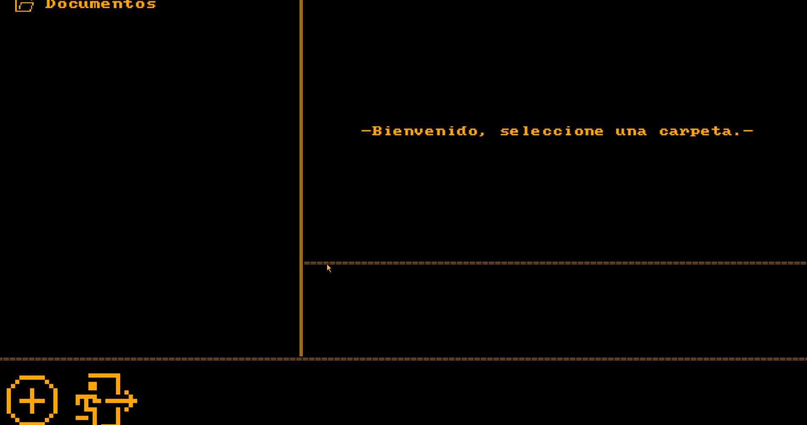

# ARCA

**Currently program just in Spanish language but intuitive enough for using without understanding the language.**

**Arca** is a password-protected folder manager for Windows that I found on an old hard drive at a yard sale.

The original code was corrupted, but I have managed to repair most of it, and it now works surprisingly well.

It allows you to create protected folders that require a password before opening them.



Protected folders remain inaccessible while locked and can only be accessed through Arca after entering the correct password.

> ⚠️ Arca is currently in development and should not be considered a high-security solution. But still it works really well
> for day to day use at **user level** high-security.

> ⚠️ **DONT LOOSE YOUR PASWORDS** - Currently there is no way of changing paswords so important document may be lost if you loose the pasword to acces them, so be carefull. 

## Features

## Features

- 🔐 Password-protected folders
- 👁️ Show/hide password
- 🗂️ Manage multiple protected folders
- 🖥️ Native Windows desktop application
- 💾 Portable version available
- 🔌 Works locally without an online account
- 🎨 Polished custom interface
- 🐍 Written in Python
- 📦 Windows installer available

## Requirements

* Windows
* Python 3.x (when running from source)
* Recomended resolution 1980x1080(things may break if not, im not good whit desing yet, but i try my best)
## Download options

### `Arca-Setup.exe` — Installer

The installer version installs Arca normally on your computer and creates the necessary shortcuts and files for regular use.

Choose this version if you want a standard Windows installation.

### `Arca.exe` — Portable

The portable version does **not** require installation.

Simply place `Arca.exe` wherever you want and run it. Arca will automatically create the **three folders required for the application to work** in the same location as the `.exe`.

This makes it suitable for keeping Arca in a specific folder, on a USB drive, or on another storage device without going through an installation process. That way you can hide the folders wherever you want for more personal security.

**In short:**

* `Arca-Setup.exe` → Normal Windows installation.
* `Arca.exe` → Portable, no installation required.

## Running from source

For developers who want to run or modify Arca directly from the source code:

git clone https://github.com/tomgix123-dotcom/ARCA.git
cd ARCA

## Building

Arca can be compiled into a standalone Windows executable using PyInstaller.

```bash
python -m PyInstaller --onefile --windowed --icon="Assets\ARCA.ico" --add-data "Assets;Assets" Arca_main.py
```

## Project status

🚧 **In development**

The current goal is to keep reparing the mysterious code and uncover more of its features.

## License

Arca is licensed under the MIT License.

